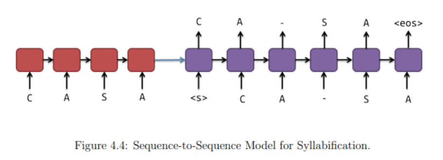

# ptbr-nlp-datasets
Brazilian Portuguese datasets for data-driven NLP algorithms (especially used for Speech Synthesis). 

The datasets contained in this repository can be used for training character-level recurrent sequence-to-sequence models.

Syllabification example:



This repository contains the following datasets in UTF-8 format:

1. Grapheme-to-Phoneme conversion
2. Grapheme + Stress to Phoneme conversion
3. Stress Marking
4. Syllabification from Grapheme conversion
5. Syllabification from Grapheme + Stress conversion

For more information regarding these applications, please check:

- dissertation-data-driven-nlp-ptbr: Master's dissertation in which these applications were proposed.
- https://lfelipesv.github.io/2018-10-23-masterspost/

This repository also contains a Perl script that can be used to calculate Word Error Rate (WER) and Phoneme Error Rate (PER):

- finder.pl

If you don't know how WER is calculate, please check: https://martin-thoma.com/word-error-rate-calculation/

## How to train a deep learning model using the datasets?

1. https://keras.io/examples/nlp/lstm_seq2seq/

To use the dataset using the Keras tutorial by Francois Chollet, change:

- Change the following line: ```input_text, target_text = line.split("\t")```
- Comment the following line: ```# encoder_input_data[i, t + 1 :, input_token_index[" "]] = 1.0```

*Obs:* If you don't have a GPU it is possible to train using Google Colab.

2. https://google.github.io/seq2seq/

To use the dataset with the Google seq2seq library, substitute the tab character in the dataset by another space character and modify the python scripts accordingly.